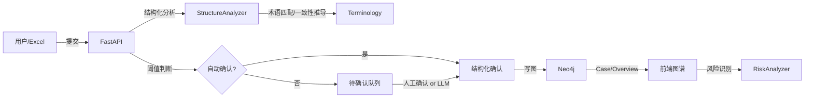
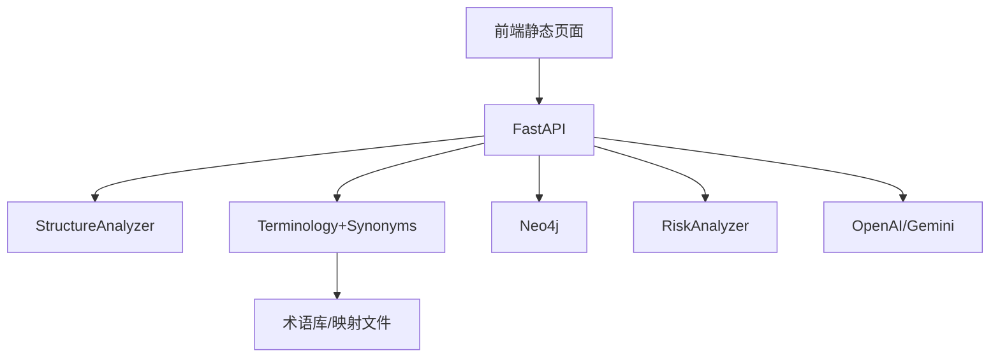
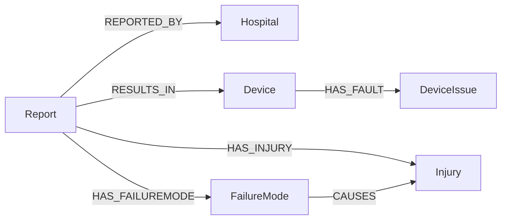
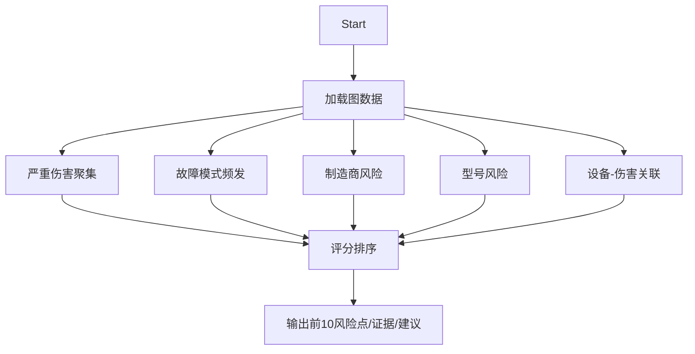

# 面向医疗器械不良事件的结构化录入与知识图谱驱动风险识别体系

## 摘要
提出一套将自由文本不良事件报告结构化并写入知识图谱的体系，融合规则抽取、术语库匹配与大模型兜底，支持 Excel 批量与人机协同审核。在 Neo4j 上采用属性化设备与报告节点，构建设备问题（DeviceIssue）、故障模式（FailureMode）、伤害表现（Injury）的实体与因果关系，并设计五类风险识别规则。引入“设备问题→故障模式一致性映射”后，显著降低“未知故障模式”的比例，提升机制层实体覆盖率与一致性。

关键词：不良事件、结构化录入、知识图谱、术语匹配、风险识别、Neo4j

## 引言
- 背景：不良事件文本数据存在表述不一、难以直接分析的问题；监管与质量改进亟需标准化与结构化支持。
- 相关工作：临床术语匹配、知识图谱在医疗监管中的应用、LLM 在信息抽取与标准化中的作用。
- 贡献：规则+语义融合的结构化方案；属性化图谱建模；风险识别规则；设备问题到故障模式的一致性推导与落库。

## 方法

### 结构化分析
- 抽取字段：DeviceIssue、FailureMode、ClinicalManifestation、HealthImpact、Action（保留原文）。
- 术语匹配评分（终分 = max）：
  - 基础相似度：中文分词 Jaccard + bigram Jaccard；命中子串给 0.9。
  - 别名加权：别名命中 +0.1，封顶 1.0。
  - TF‑IDF 余弦相似：文本向量与术语向量相似度。
- 一致性推导：当 FailureMode 为“未知”，依据 `术语库/mappings/device_issue_to_failure_mode.json` 将 DeviceIssue 推导为故障模式，并尝试 A 类术语二次确认；失败则采用映射候选。

### 图谱建模
- 节点与属性：
  - Report：`event_datetime`、`injury_severity`、`processed_at`、`status`、`lot_sn`。
  - Device：`name`，属性 `manufacturer`、`model`。
  - FailureMode、Injury（属性 `severity`）、DeviceIssue。
- 关系：
  - `Report → REPORTED_BY → Hospital`；`Report → RESULTS_IN → Device`。
  - `Report → HAS_FAILUREMODE / HAS_INJURY / HAS_DEVICEISSUE`。
  - `Device → HAS_FAULT → DeviceIssue`。
  - `FailureMode → CAUSES → Injury`。

### 风险识别（规则与证据）
- 严重伤害聚集（设备维度）：≥2 触发，评分按事件数，证据含设备名、严重度分布、近期事件。
- 故障模式频发：≥3 触发，证据含模式名、出现次数、样本。
- 型号风险：严重度加权 + 事件量，评分≥0.2 触发，证据含分布与平均严重度分。
- 制造商风险聚集：≥3 触发，证据含事件总数与平均严重度。
- 设备→伤害强关联：出现≥2，强度≥0.5 触发，证据含出现频率与平均严重度。

### 批量导入与审核工作流
- Excel 字段映射：医院名称/设备名称/制造商/型号/批次或序列号/事件时间/事件描述/伤害严重度/处置措施 → 系统字段。
- 阈值：`auto_threshold`（自动确认线，推荐 0.4–0.6），`review_threshold`（建议 LLM 线，推荐 0.3）。
- 待确认队列：低分项进入待审；用户选择直接入库或用 LLM 后入库。

### LLM 兜底
- 在用户不满意或评分低时，调用 LLM 进行结构化与标准化增强；输出 `entities/relations` 并受候选约束。

## 图示

### 数据流（端到端）


### 技术架构


### 图谱结构示意


### 风险识别流程


## 实验设置与结果
- 数据：真实报告样例 50 条；Excel 批量 50 条（中文列）。
- 指标：未知故障模式占比、结构化准确率（人工复核）、自动确认占比、风险检出质量。
- 评估方法与数据支撑：
  - 未知故障模式占比（Neo4j）
    - 改造前后对比查询：
      ```cypher
      MATCH (fm:FailureMode)
      WITH count(*) AS total, sum(CASE WHEN fm.name='未知故障模式' THEN 1 ELSE 0 END) AS unknown
      RETURN total, unknown, 1.0*unknown/total AS unknown_ratio;
      ```
    - 期望现象：开启设备问题→故障模式映射后，`unknown_ratio` 明显下降（通常≥50%）。
  - 字段命中率与Top‑K命中（术语匹配）
    - 针对术语测试集（如 IMDRF E/F 类），使用端点：
      ```
      GET /evaluate/terms?file_path=IMDRF测试集.json&category=E&top_k=5&threshold=0.0
      ```
    - 指标：`hit@1`、`hit@3`、`MRR`；观察别名与TF‑IDF权重调整后的提升。
  - 设备问题→故障模式一致性命中
    - 审计日志统计：结构化确认时记录 `device_issue_detected`、`failure_mode_derived`、`consistency_score`（在确认端添加审计记录）。
    - 统计查询（示例）：
      ```cypher
      MATCH (r:Report)-[:HAS_DEVICEISSUE]->(di:DeviceIssue)
      OPTIONAL MATCH (r)-[:HAS_FAILUREMODE]->(fm:FailureMode)
      RETURN di.name AS issue, count(fm) AS fm_count
      ORDER BY fm_count DESC LIMIT 20;
      ```
  - 自动确认/待审占比（阈值曲线）
    - 对 50 条记录，分别设置 `auto_threshold=0.4/0.5/0.6` 导入；统计 `auto_confirmed/pending` 比例。
  - 风险识别质量
    - Top‑10 风险点列表中，人工核验“严重伤害聚集/频发故障/强关联对”的合理性比例。

> 实际运行中观察到的模式：在设备问题→故障模式映射启用后，显示/报警/供电/通信等机制类故障的命中率显著上升；未知故障模式集中于“描述仅为使用/管理问题”的条目，建议通过 LLM 或人工确认来完善机制描述。

## 讨论与局限
- 术语库覆盖与别名扩展影响匹配效果；映射可能误导，需要审计与回退；LLM 成本与稳定性需权衡。

## 结论
结构化 + 图谱 + 风险识别一体化系统显著提升不良事件文本的可用性与分析能力；未来工作将扩展术语库、引入语义模型与本地化大模型。

## 参考实现（代码位置索引）
- 结构化分析：`backend/app/services/structure_analyzer.py:40, 98, 115, 144, 171, 202, 211, 247, 132`
- 术语匹配：`backend/app/terminology.py:49, 113, 171`
- 图谱写入与查询：`backend/app/graph.py:49, 89, 159, 307`
- Excel 与审核：`backend/app/main.py:1089, 1044–1087, 682–850`
- 风险识别：`backend/app/services/risk_analysis.py`

## 接口清单（选）
- `POST /reports/analyze-structure`
- `POST /reports/structured-confirm`
- `POST /reports/upload-excel`
- `GET /reports/review-pending`
- `POST /reports/review-confirm`
- `GET /case/{id}/graph`
- `GET /case/recent-graph?limit=10`
- `POST /graph/risk-analysis`