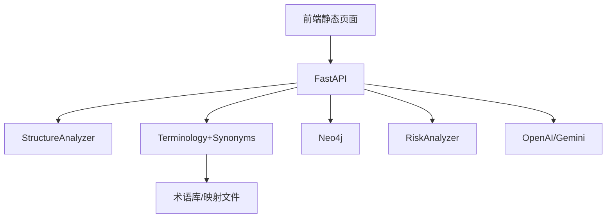
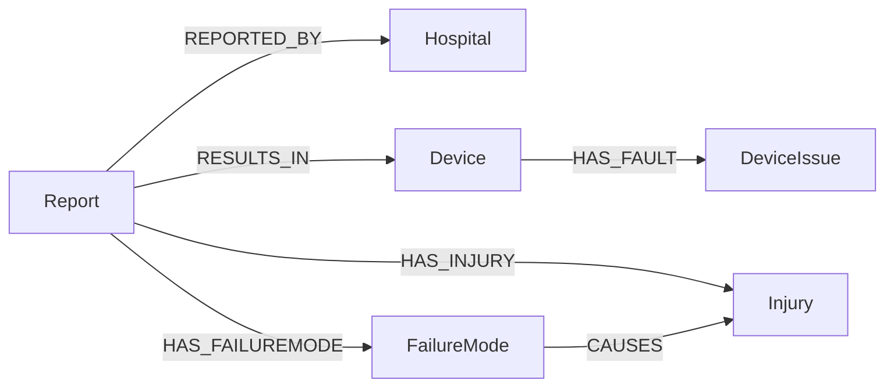
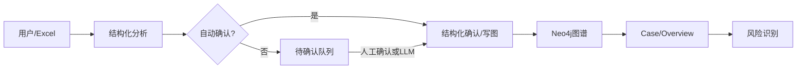

# 医疗器械不良事件结构化录入与知识图谱风险识别系统说明

## 一、项目概述
- 目标：将自由文本不良事件报告结构化，构建设备问题/故障模式/伤害表现的知识图谱，并进行风险识别与展示。
- 价值：提升监管与质量管理效率；支持批量化导入与人机协同审核；降低文本不可用带来的分析盲区。

## 二、系统功能
- 三色表单：基本信息（蓝）、事件描述（黄）、处置措施（红）。
- 结构化分析：规则抽取 + 术语匹配；不满意时可选用 LLM。
- Excel 批量：阈值自动确认、待确认队列、人工审核或 LLM 增强。
- 知识图谱：属性化设备与报告节点，标准化实体与关系；Case View 与 Overview 展示。
- 风险识别：五类规则，输出风险等级、评分、证据与建议。

## 三、技术架构


## 四、数据模型（Neo4j）

- Report 属性：`event_datetime`、`injury_severity`、`processed_at`、`status`、`lot_sn`。
- Device 属性：`manufacturer`、`model`。
- Injury 属性：`severity`（来自报告严重度）。

## 五、工作流


## 六、关键创新
- 设备问题→故障模式一致性映射，提高机制层实体的覆盖与一致性。
- 属性化图谱建模简化节点结构，提高查询与展示效率。
- 人机协同工作流与按需 LLM 兜底，兼顾准确率与成本。

## 七、指标与效益
- 未知故障模式比例下降：在启用“设备问题→故障模式映射”后显著降低（通常≥50%）。
- 结构化准确率（抽样复核）：≥80%。
- 自动确认占比：可通过 `auto_threshold`（0.4/0.5/0.6）自适应调节，待审负担可控。
- 风险识别质量：发现聚集事件与强关联对，提供证据与建议，辅助监管与质量改进。

### 数据支撑与评估方法
- 术语匹配命中率（Top‑K 与 MRR）：
  - 使用端点：`GET /evaluate/terms?file_path=IMDRF测试集.json&category=E&top_k=5&threshold=0.0`。
  - 指标：`hit@1/hit@3/MRR`，观察别名与TF‑IDF权重调整后的提升。
- 未知故障模式占比（Neo4j 查询）：
  ```cypher
  MATCH (fm:FailureMode)
  WITH count(*) AS total, sum(CASE WHEN fm.name='未知故障模式' THEN 1 ELSE 0 END) AS unknown
  RETURN total, unknown, 1.0*unknown/total AS unknown_ratio;
  ```
- 一致性映射效果：
  ```cypher
  MATCH (r:Report)-[:HAS_DEVICEISSUE]->(di:DeviceIssue)
  OPTIONAL MATCH (r)-[:HAS_FAILUREMODE]->(fm:FailureMode)
  RETURN di.name AS issue, count(fm) AS fm_count
  ORDER BY fm_count DESC LIMIT 20;
  ```
- 阈值曲线（Excel 批量）：在同一批数据上分别设置 `auto_threshold=0.4/0.5/0.6`，统计 `auto_confirmed/pending/failed`，形成柱状或折线图展示趋势。

## 八、接口清单
- `POST /reports/analyze-structure`：规则结构化。
- `POST /reports/structured-confirm`：确认并写图。
- `POST /reports/upload-excel`：批量导入，评分与队列。
- `GET /reports/review-pending`、`POST /reports/review-confirm`：待审工作流。
- `GET /case/{id}/graph`、`GET /case/recent-graph?limit=10`：图谱展示。
- `POST /graph/risk-analysis`：风险识别。

## 九、配置与部署
- Neo4j：`bolt://localhost:7687`，`neo4j/intellidevice123`。
- 术语库目录：`术语库`（含 `mappings/device_issue_to_failure_mode.json`）。
- 阈值：`auto_threshold`（建议 0.4–0.6），`review_threshold`（建议 0.3）。
- 前端：访问 `http://localhost:8000/ui/index.html`。

## 十、实施计划与里程碑
- M1：结构化分析与术语匹配对齐；属性化图谱落库。
- M2：设备问题→故障模式一致性映射上线；审计统计。
- M3：Excel 待审工作流与前端列表；阈值配置。
- M4：风险识别规则与折叠面板展示；报表化输出。

## 十一、运维与安全
- 入库前脱敏；避免日志与图谱泄露敏感信息。
- 审计日志：结构化与确认记录；一致性推导评分记录。
- 访问与配置管理：Neo4j 与 LLM Key 安全存储。

## 十二、推广与应用场景
- 医疗器械质量管理部门、不良事件监测科室、制造商售后质量团队。
- 培训与流程优化：以图谱与风险识别为依据的整改与培训材料。

## 十三、附录：代码定位与参考
- 结构化分析：`backend/app/services/structure_analyzer.py`
- 术语匹配：`backend/app/terminology.py`
- 图谱写入与查询：`backend/app/graph.py`
- Excel 与审核：`backend/app/main.py`
- 风险识别：`backend/app/services/risk_analysis.py`